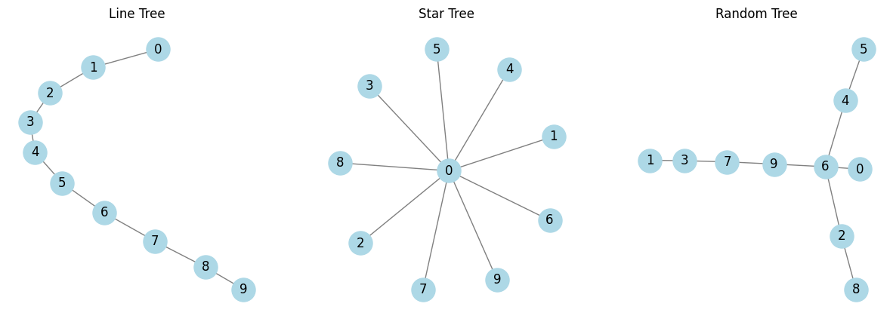

# Network Analysis


<!-- WARNING: THIS FILE WAS AUTOGENERATED! DO NOT EDIT! -->

## Imports

We are using `networkx` but `graphtools` is faster so we try this later.

There is also a gpu version of networkx from nvdida that I would like to
try later.

Number of nodes

## Exercise 1

I didn’t do anything for the first exercise.

## Exercise 2

There were 5 Tasks in the second exercise.

### Task 1

### Task 2

### Task 3

### Task 4

### Task 5

## Exercise 3

There are 5 Tasks in the third exercise.

### Task 1

### Task 2

### Task 3

### Task 4

### Task 5

------------------------------------------------------------------------

<a
href="https://github.com/flupppi/networks/blob/main/networks/networkanalysis.py#L18"
target="_blank" style="float:right; font-size:smaller">source</a>

### generate_random_tree

>  generate_random_tree (num_nodes, seed=None)

``` python
# Generate three types of trees
line_tree = nx.path_graph(n)  # Line/tree path
star_tree = nx.star_graph(n - 1)  # Center node 0, all others connect to it
random_tree = generate_random_tree(n, seed=42)  # Random tree
```

------------------------------------------------------------------------

<a
href="https://github.com/flupppi/networks/blob/main/networks/networkanalysis.py#L43"
target="_blank" style="float:right; font-size:smaller">source</a>

### draw_trees

>  draw_trees (trees, titles)

``` python
# Draw the trees
draw_trees([line_tree, star_tree, random_tree], ["Line Tree", "Star Tree", "Random Tree"])
```



``` python
import networkx as nx
import matplotlib.pyplot as plt
import numpy as np
```

``` python
# Settings
n_max = 10
k_bar = 1.2

for n in range(10, n_max, 10):
    m = int((k_bar * n) / 2)
    G = nx.gnm_random_graph(n, m)

    # Get the size of the largest component
    largest_cc = max(nx.connected_components(G), key=len)
    G_sub = G.subgraph(largest_cc)

    # Plot largest component only
    plt.figure(figsize=(5, 5))
    pos = nx.spring_layout(G_sub)
    nx.draw(G_sub, pos, node_color='lightblue', with_labels=False, node_size=30)
    plt.title(f'n = {n}, k̄ = {k_bar}, giant component size = {len(G_sub)}')
    plt.axis('off')
    plt.show()
```

``` python
import numpy as np
import matplotlib.pyplot as plt
from scipy.optimize import fsolve
```

------------------------------------------------------------------------

<a
href="https://github.com/flupppi/networks/blob/main/networks/networkanalysis.py#L69"
target="_blank" style="float:right; font-size:smaller">source</a>

### giant_component_size

>  giant_component_size (k)

``` python
k_vals = np.linspace(0, 3, 300)
S_vals = [giant_component_size(k) for k in k_vals]

plt.figure(figsize=(8, 5))
plt.plot(k_vals, S_vals, label='Size of giant component $S$')
plt.axvline(1, color='red', linestyle='--', label='Phase transition at $\\langle k \\rangle = 1$')
plt.xlabel('Average degree $\\langle k \\rangle$')
plt.ylabel('Giant component size $S$ (fraction of nodes)')
plt.title('Emergence of the Giant Component')
plt.grid(True)
plt.legend()
plt.show()
```

    /tmp/ipykernel_193901/2603444820.py:7: RuntimeWarning: The iteration is not making good progress, as measured by the 
     improvement from the last ten iterations.
      S_solution, = fsolve(func, S_guess)


------------------------------------------------------------------------

<a
href="https://github.com/flupppi/networks/blob/main/networks/networkanalysis.py#L69"
target="_blank" style="float:right; font-size:smaller">source</a>

### giant_component_size

>  giant_component_size (k)

------------------------------------------------------------------------

<a
href="https://github.com/flupppi/networks/blob/main/networks/networkanalysis.py#L79"
target="_blank" style="float:right; font-size:smaller">source</a>

### update_graph

>  update_graph (n=100, k_bar=0.5)
