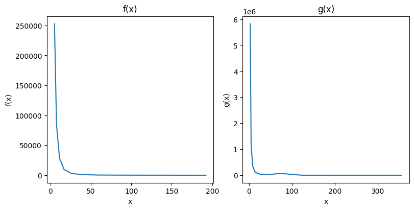
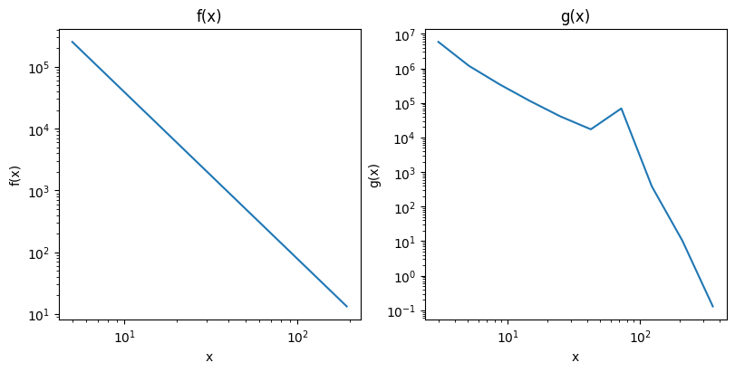
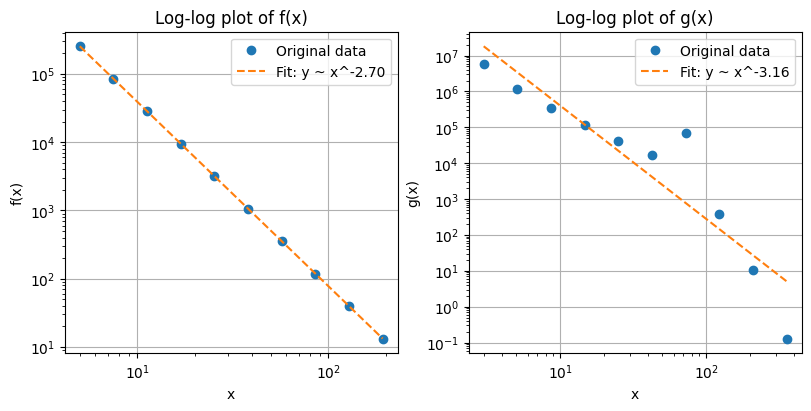
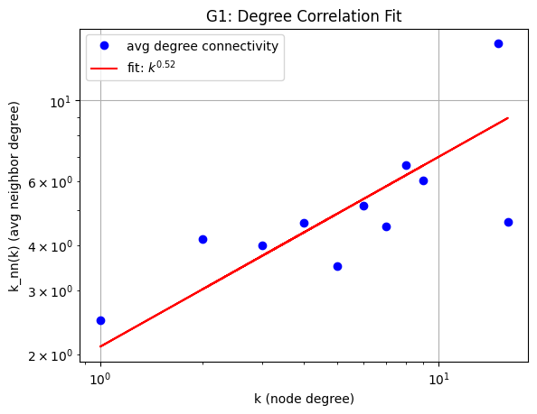
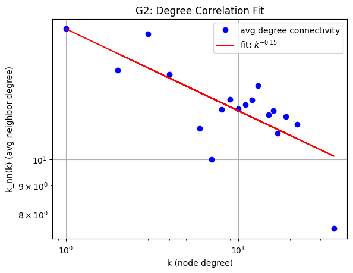
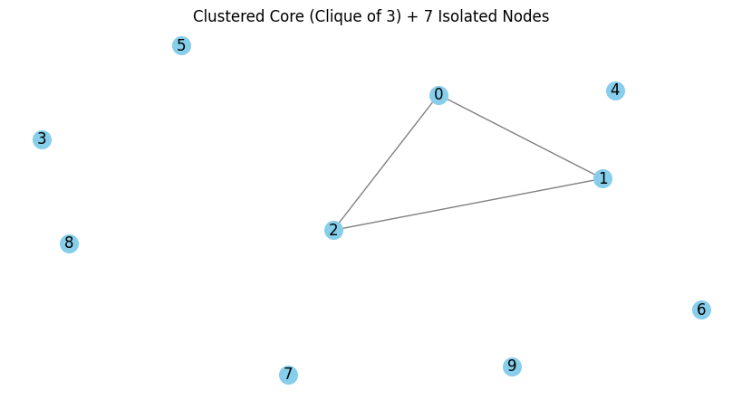
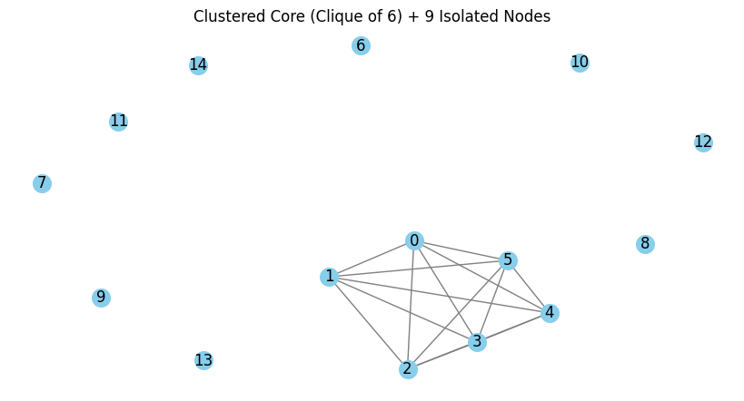
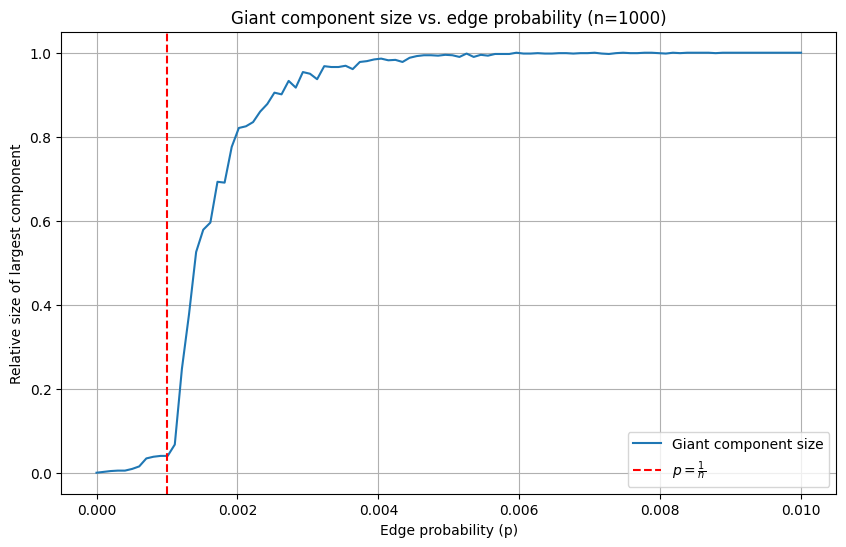
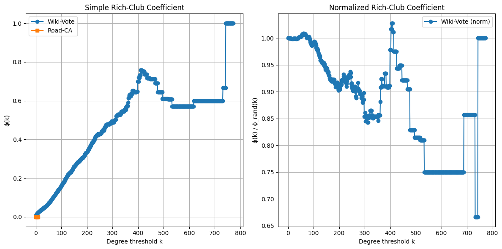

# Network Analysis Exercise 3


<!-- WARNING: THIS FILE WAS AUTOGENERATED! DO NOT EDIT! -->

## 1) Power-law behaviour

(2 points) The tables show function values for functions *f*(*x*) and
*g*(*x*) on different values of *x*. Plot the function values in a way
that allows you to determine if any of the functions exhibits power-law
behavior. If yes, determine the exponent.

<table>
<thead>
<tr>
<th><span class="math inline"><em>x</em></span></th>
<th><span class="math inline"><em>f</em>(<em>x</em>)</span></th>
</tr>
</thead>
<tbody>
<tr>
<td>5.00</td>
<td>252822.43</td>
</tr>
<tr>
<td>7.50</td>
<td>84599.77</td>
</tr>
<tr>
<td>11.25</td>
<td>28308.89</td>
</tr>
<tr>
<td>16.88</td>
<td>9472.76</td>
</tr>
<tr>
<td>25.31</td>
<td>3169.79</td>
</tr>
<tr>
<td>37.97</td>
<td>1060.68</td>
</tr>
<tr>
<td>56.95</td>
<td>354.93</td>
</tr>
<tr>
<td>85.43</td>
<td>118.77</td>
</tr>
<tr>
<td>128.14</td>
<td>39.74</td>
</tr>
<tr>
<td>192.22</td>
<td>13.30</td>
</tr>
</tbody>
</table>

<table>
<thead>
<tr>
<th><span class="math inline"><em>x</em></span></th>
<th><span class="math inline"><em>g</em>(<em>x</em>)</span></th>
</tr>
</thead>
<tbody>
<tr>
<td>3.00</td>
<td>5824779.30</td>
</tr>
<tr>
<td>5.10</td>
<td>1185913.90</td>
</tr>
<tr>
<td>8.67</td>
<td>347172.77</td>
</tr>
<tr>
<td>14.74</td>
<td>114200.30</td>
</tr>
<tr>
<td>25.06</td>
<td>40746.59</td>
</tr>
<tr>
<td>42.60</td>
<td>17235.83</td>
</tr>
<tr>
<td>72.41</td>
<td>69248.85</td>
</tr>
<tr>
<td>123.10</td>
<td>384.66</td>
</tr>
<tr>
<td>209.27</td>
<td>10.41</td>
</tr>
<tr>
<td>355.76</td>
<td>0.13</td>
</tr>
</tbody>
</table>

### Solution

To provide a solution to the exercise: Provide your plot, report your
judgment on power-law behavior and in case the exponent.

Data plotted for *f*(*x*) and *g*(*x*):



Power law is defined with *P*<sub>*k*</sub> = *C**k*<sup>*α*</sup>.

Values for alpha are often in the range 2-3 and taking the log of
function and argument leads to a linear relation, visible as a diagonal
straight line in a log-log plot.



This can be seen here where we have a straight line for *f*(*x*) but not
for *g*(*x*) which suggests that we only have a power-law for *f*(*x*).
But the lecture notes, that looking at the diagram alone might be
deceiving. In particular, if the data is incomplete. True power law
should be monotonically decreasing and node degree might deviate for
small k.

So to validate this further, we can show that a function has power law
behavior if it satisfies
*f*(*x*) ∼ *x*<sup>−*α*</sup>
*f*(*x*) = *C* ⋅ *x*<sup>*α*</sup>
So taking logarithms gives us a linear relationship:
log (*f*(*x*)) = −*α* ⋅ log (*x*) + log (*C*)
We can estimate the exponent *α* using linear regression on the
log-transformed data.

------------------------------------------------------------------------

<a
href="https://github.com/flupppi/networks/blob/main/networks/networks03.py#L8"
target="_blank" style="float:right; font-size:smaller">source</a>

### plot_linregress_comparison

>  plot_linregress_comparison (x, y, name, ax)

    Estimated power-law exponent f(x): α ≈ 2.70
    R-squared f(x): 1.000000
    Estimated power-law exponent g(x): α ≈ 3.16
    R-squared g(x): 0.850754



The estimated slope from the regression of *f*(*x*) is -*α*, giving us
*α* ≈ 2.70

The *R*<sup>2</sup> value of the regression is 1.0, indicating a strong
fit.

For *g*(*x*) we see that it does not follow a clear power-law pattern
based on the regression and the low *R*<sup>2</sup> value.

## 2) Categorizing Networks

(2 points) In the lecture we discussed a simple way to quantify
assortativity and to assign a network into one of the three categories
by fitting a power function to the degree correlation
*k̄*<sub>*n**n*</sub>(*k*). Try this approach for the networks
`As3G1.txt` and `As3G2.txt` in Ilias and report your results. Note this
correlation is implemented (e.g. in networkx as
average_degree_connectivity) A more formally sound version is to simply
use the Pearson correlation coefficient *r* of the degrees at either
ends of the graph’s edges. As it is normalized, it lies between
−1 ≤ *r* ≤ 1 and can be interpreted the same way as our correlation
exponent.
$$r = \frac{1}{\sigma^2_q}\sum\_{jk}jk(e\_{jk}-q_jq_k)$$
with *σ*<sub>*q*</sub><sup>2</sup> being the variance of excess degree
distribution *q*(*k*). Luckily, this measure is also already implemented
in many analysis tools (e.g. networkx as
degree_pearson_correlation_coefficient). Apply the method on the
network, report your result and compare to the finding for the first
method. Then run a number (e.g. 10) of degree sequence preserving
randomization and report if/which changes occur to the second measure.

### Solution

To provide a solution to the exercise: Provide the diagram for the
fitting, and your correlation exponent, the result for pearson
correlation for the original and randomised networks.

The networks are stored as edge lists. `As3G2` additionally has edge
weights. So first we need to load them:

``` python
G1 = nx.read_adjlist("../data/As3G1.txt", nodetype=int)
print(len(G1.edges))
print(len(G1.nodes))
G2 = nx.Graph()
with open("../data/As3G2.txt") as f:
    for line in f:
        a, b, attr = line.strip().split(maxsplit=2)
        G2.add_edge(a, b, **ast.literal_eval(attr))
print(len(G2.edges))
print(len(G2.nodes))
```

    565
    430
    254
    77

To quantify the assortativity of the network we solve
*k̄*<sub>*n**n*</sub> = *a**k*<sup>*μ*</sup> for the correlation exponent
*μ* and categorize it. \* *μ* \> 0: assortative (high-degree nodes link
to high-degree) \* *μ* \< 0: disassortative \* *μ* ≈ 0: neutral

------------------------------------------------------------------------

<a
href="https://github.com/flupppi/networks/blob/main/networks/networks03.py#L30"
target="_blank" style="float:right; font-size:smaller">source</a>

### power_law

>  power_law (x, a, b)

We compute the [average degree
connectivity](https://networkx.org/documentation/stable/reference/algorithms/generated/networkx.algorithms.assortativity.average_degree_connectivity.html)
and get a dictionary keyed by degree k with the value of average
connectivity.

We can fit a line on these values to get an estimation of our
correlation exponent.

------------------------------------------------------------------------

<a
href="https://github.com/flupppi/networks/blob/main/networks/networks03.py#L34"
target="_blank" style="float:right; font-size:smaller">source</a>

### fit_degree_connectivity

>  fit_degree_connectivity (graph, title)

------------------------------------------------------------------------

<a
href="https://github.com/flupppi/networks/blob/main/networks/networks03.py#L58"
target="_blank" style="float:right; font-size:smaller">source</a>

### categorize_assortativity

>  categorize_assortativity (mu, name)

``` python
mu_G1 = fit_degree_connectivity(G1, "G1: Degree Correlation Fit")

mu_G2 = fit_degree_connectivity(G2, "G2: Degree Correlation Fit")
categorize_assortativity(mu_G1, "G1")

categorize_assortativity(mu_G2, "G2")
```





    The calculated exponentv for G1: 0.523 shows a assortative degree correlation.
    The calculated exponentv for G2: -0.145 shows a disassortative degree correlation.

Next we should compare the `average_degree_connectivity` with the
[degree_pearson_correlation_coefficient](https://networkx.org/documentation/stable/reference/algorithms/generated/networkx.algorithms.assortativity.degree_pearson_correlation_coefficient.html)
results which returns the assortativity of graph by degree.

``` python
# compare the results
pearson_G1 = nx.degree_pearson_correlation_coefficient(G1)
pearson_G2 = nx.degree_pearson_correlation_coefficient(G2)

print(f"G1 Pearson: {pearson_G1:.4f}, G2 Pearson: {pearson_G2:.4f}")
```

    G1 Pearson: 0.7332, G2 Pearson: -0.1652

Here, *G*1 is assortative and *G*2 is disassortative.

Next we should run 10 degree sequence preserving randomizations and show
which changes occur in the second measure. We do this by swapping edges
in the network.

- If the randomized networks lose any assortativity, that suggests the
  observed structure is meaningful.
- If the Pearson correlation stays similar → the degree sequence alone
  explains assortativity.

In the results we can see that for *G*1 the assortativity clearly
changes to negative or very small values suggesting that the structure
is meaningful.

For *G*1 there is no such change visible.

------------------------------------------------------------------------

<a
href="https://github.com/flupppi/networks/blob/main/networks/networks03.py#L70"
target="_blank" style="float:right; font-size:smaller">source</a>

### randomize_and_measure

>  randomize_and_measure (graph, n_iter=10)

    Randomized Pearson G1: [0.004137654023765612, -0.0729776597452127, -0.05565167531120767, -0.10058177053837325, -0.011426365891527044, -0.027460243011809632, -0.036857387111609005, -0.046195799060784595, -0.09183068009543512, -0.03245247581482806]
    Randomized Pearson G2: [-0.197891215644392, -0.11538767953142574, -0.23489350233836423, -0.15175398942284535, -0.15909663068868046, -0.1306511227926893, -0.17175835066677408, -0.1566105395514292, -0.18083547412138914, -0.2259320110296678]

## 3) Finding a graph with certain properties

(2 points) We discussed in the lecture that there are differing
definitions for average (*C*<sub>*G*</sub>) and global clustering
coefficient (*C*<sub>*G**G*</sub>).

- 1)  Given the double star graph family from Assignment 2.2, where we
      showed that both values diverge (*C*<sub>*G*</sub> → 1,
      *C*<sub>*G**G*</sub> → 0) for increasing *k* (periphery nodes):
      Can you find a graph family for which they approach the opposite
      values or at least go in the opposite direction compared to double
      star? In case, describe it and give the general formula for its
      clustering coefficients.
- 2)  What is the smallest graph you can find for which the two values
      differ?

### Solution

To provide a solution to the exercise: Provide the description, formula,
and graph.

- Ich hab keine ahnung wie ich das angehen sollte ausser das an Gpt zu
  senden.

In exercise 2.2 we looked at a network with two core nodes connected by
an edge, and k peripheral nodes that each are connected exactly to the
two core nodes (creating triangles): We observed the values for
*C*<sub>*G*</sub> and *C*<sub>*G**G*</sub> noting that for large *k*,
*C*<sub>*G*</sub> was much larger than *C*<sub>*G**G*</sub>.

So to flip it, we want: \* Many connected triplets (to raise the
denominator of *C*<sub>*G*</sub>) \* Few locally closed triangles for
most nodes (to keep *C*<sub>*G*</sub>) \* But still many triangles in
total (to raise numerator of *C*<sub>*G**G*</sub>)

We define a graph family consisting of a clique of size *k* and
*n* − *k* isolated nodes. The global clustering coefficient is always
*C*<sub>*G**G*</sub> = 1, while the average local clustering coefficient
is $C_G=\frac{k}{n}$, which goes to 0 as *n* → ∞

This is the opposite of the double star graph family, where
*C*<sub>*G*</sub> → 1, but *C*<sub>*G**G*</sub> → 0.

1.  Global clustering *C*<sub>*G*</sub>*G*:

    The clique has $\begin{pmatrix}k\\3\end{pmatrix}$ triangles and
    $\begin{pmatrix}k\\2\end{pmatrix}\cdot(k−2)$ triplets.

    The isolated nodes add nothing.

    So:
    $$C\_{GG}=\frac{3\cdot\begin{pmatrix}k\\3\end{pmatrix}}{\begin{pmatrix}k\\3\end{pmatrix}\cdot \frac{k-2}{3}} = 1$$
    (since it’s a clique → every triplet is closed →
    *C*<sub>*G**G*</sub> = 1)

2.  Average local clustering *C*<sub>*G*</sub>:

    Clique nodes have *C*<sub>*v*</sub> = 1

    Isolated nodes have *C*<sub>*v*</sub> = 0

    So:
    $$C_G=\frac{k⋅1+(n−k)⋅0}{n}=\frac{k}{n}$$

    → goes to 0 as *n* → ∞ for fixed *k*

------------------------------------------------------------------------

<a
href="https://github.com/flupppi/networks/blob/main/networks/networks03.py#L81"
target="_blank" style="float:right; font-size:smaller">source</a>

### clustered_core_with_isolates

>  clustered_core_with_isolates (n=10, k=3)

*Create a graph with a clique of size `k` and `n-k` isolated nodes.*

``` python
# Example graph with k=3 (clique) and n=10 (total nodes, 7 isolates)
G = clustered_core_with_isolates(n=10, k=3)
G1= clustered_core_with_isolates(n=15, k=6)
```





## 4) Giant component

(2 points) In the last lecture we discussed the growth of the giant
component during the creation of a graph by the random model. Run an
experiment with increasing values of the edge probability and report the
development of the giant component size (relative to the number of nodes
in the graph) in relation to the probability values.

### Solution

To provide a solution to the exercise: Provide a diagram that shows the
development of the size over the range of probability values.

For *n* = 1000 nodes and 100 values in the probability range from
*p* ∈ \[0, 0.01\], at each step we generate a random graph *G*(*n*, *p*)
and compute the relative size of the largest connected component
$$\frac{\text{size of largest component}}{n}$$

We plot the critical threshold for the emergence of the giant component
in as approximately $p = \frac{1}{n}$

- Below the threshold, most components are small.
- Around the threshold, the large connected component suddenly grows.
- Above the threshold, the giant component rapidly dominates the graph.



## 5) Rich Club

(2 points) Select two networks from different categories of the SNAP
Large Network Collection (https://snap.stanford.edu/data/index.html).
Calculate the simple version of the rich club coefficient (*ϕ*(*k*) )
for each network and report it in a diagram as shown in the lecture.
Then calculate the improved version *ρ*<sub>*r**a**n*</sub>(*k*) and
report the result.

### Solution

To provide a solution to the exercise: Shortly describe the networks,
provide the diagrams and your verdict on rich club phenomenon.

What is the formula for *ϕ*(*k*) and *ρ*<sub>*r**a**n*</sub>(*k*).

Use each formula to implement an algorithm solving this calculation and
apply it to the graph. Alternately use a predefined algorithm if it is
available and just

#### Networks Used

Wikipedia Vote Network (directed, but we make it undirected)

- Nodes: 7,115
- Edges: 103,689
- Description: Directed graph of Wikipedia users voting in admin
  elections. An edge from user A to B means A voted for B.
- Source: [SNAP
  Wiki-Vote](https://snap.stanford.edu/data/wiki-Vote.html)

California road network (undirected)

- Nodes: 1,965,206
- Edges: 2,766,607
- Description: A road network of California. Intersections and endpoints
  are represented by nodes and the roads connecting these intersections
  or road endpoints are represented by undirected edges.
- Source: [SNAP California
  Road](https://snap.stanford.edu/data/roadNet-CA.html)

EU Email Communication Network (sadly does not work because of self
loops)

- Nodes: 265,214
- Edges: 420,045
- Description: Directed email exchange graph from a European research
  institution. An edge from A to B means A sent an email to B.
- Source: [SNAP
  Email-EuAll](https://snap.stanford.edu/data/email-EuAll.html)

#### Rich Club

The rich club coefficient *φ*(*k*) measures the tendency of high-degree
nodes (*d**e**g**r**e**e* \> *k*) to be more densely interconnected than
expected.

Simple Rich-Club Coefficient:
$$ϕ(k)=\frac{2E_k}{N_k(N_k−1)}$$

Where:

- *N*<sub>*k*</sub>: number of nodes with degree \> kk
- *E*<sub>*k*</sub>: number of edges between those nodes

Normalized Rich-Club Coefficient (Improved Version):
$$ρ(k)=\frac{ϕ(k)}{ϕ\_{rand}(k)}$$

Where *ϕ*<sub>*r**a**n**d*</sub>(*k*) is the rich-club coefficient for a
randomized version of the network with the same degree distribution.

A value *ρ*(*k*) \> 1 indicates a rich club phenomenon.

``` python
#Loading the graphs
#G_email = nx.read_adjlist("../data/email-EuAll.txt", nodetype=int, create_using=nx.DiGraph())
#G_email = G_email.to_undirected()
G_wiki = nx.read_adjlist("../data/Wiki-Vote.txt", nodetype=int, create_using=nx.DiGraph())
G_wiki = G_wiki.to_undirected()
```

``` python
G_road = nx.read_adjlist("../data/roadNet-CA.txt", nodetype=int)
```

``` python
rich_road = nx.rich_club_coefficient(G_road, normalized=False)
# doesnt work because it has self loops
# rich_email = nx.rich_club_coefficient(G_email, normalized=False)
```

``` python
# Simple rich-club coefficient
rich_wiki = nx.rich_club_coefficient(G_wiki, normalized=False)
```

``` python
# Normalized version
rich_wiki_norm = nx.rich_club_coefficient(G_wiki, normalized=True, Q=10)
```

``` python
# Normalized version
#rich_road_norm = nx.rich_club_coefficient(G_norm, normalized=True, Q=10)
# tooo slow, didnt finsih. I guess the Graph is just too large.
```


